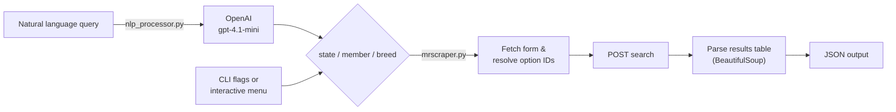

<div align="center">

# 🐐 MrScraper

**An intelligent scraper for the [AMGR Breeder Directory](https://www.amgr.org/frm_directorySearch.cfm). Search it with filters, or just ask in plain English.**


</div>

```bash
$ python mrscraper.py --nl "Find breeders in Iowa with American Savanna"
```

```json
{
  "header": ["Action", "State", "Name", "Farm", "Phone", "Website"],
  "data": [
    ["navigate_pagination", "IA", "Dennis & Stacy Ratashak", "Ratashak Harvest Hills - RHH", "(703) 850-4113", ""]
  ]
}
```

---

## ✨ Features

| | |
|---|---|
| 🗣️ **Natural language search** | Turns queries like *"Who is the breeder named Dwight Elmore?"* into structured filters using an LLM |
| 🎯 **Fuzzy filter matching** | `--state iow` matches *Iowa*; partial member and breed names work too |
| 🧭 **Interactive mode** | Run with no arguments to pick state, member, and breed from numbered menus |
| 🛡️ **Resilient form detection** | Finds form fields dynamically instead of hard-coding selectors, so small site changes don't break it |
| 📦 **Clean JSON output** | Results come back as a `header` + `data` table, ready to pipe into other tools |
| ✅ **Automated validation** | An 8-case test suite checks live results against expected output and writes JSON reports |
| 🐛 **Debug mode** | Saves raw HTML snapshots so you can see exactly what the scraper saw |

## 🏗️ How it works



## 🚀 Quick start

```bash
git clone https://github.com/AustinPardosi/Intelligent-Web-Scraping.git
cd Intelligent-Web-Scraping
pip install -r requirements.txt

python mrscraper.py --state "Kansas"
```

To use natural language search, add your OpenAI key:

```bash
cp .env.example .env   # then set OPENAI_API_KEY=sk-...
```

A shell variable works too: `export OPENAI_API_KEY=sk-...` (`set` on Windows). Without a key, the regular filters still work and the NL feature is simply unavailable.

## 📖 Usage

### Command line

```bash
python mrscraper.py [--state STATE] [--member MEMBER] [--breed BREED] [--nl QUERY] [--debug]
```

| Option | Description | Example |
|---|---|---|
| `--state` | Filter by US state | `"Kansas"` |
| `--member` | Filter by breeder name | `"Dwight Elmore"` |
| `--breed` | Filter by breed | `"(AR) - American Red"` |
| `--nl`, `--natural-language` | Search with a plain-English query (needs `OPENAI_API_KEY`) | `"Find breeders in Kansas"` |
| `--debug` | Save raw HTML to `debug/` | |

Filters can be combined:

```bash
python mrscraper.py --state "Kansas" --member "Elmore"
```

### Natural language

```bash
python mrscraper.py --nl "Show all breeders with American Red breed"
```

More queries to try:

- *"Find breeders in Kansas"*
- *"Who is the breeder named Dwight Elmore?"*
- *"Find breeders in Alabama who have American Black"*

The query is parsed into `state`, `member`, and `breed` before the search runs, so you can see how it was interpreted.

### Interactive mode

```bash
python mrscraper.py
```

Walks you through each step: debug on or off, natural language or menus, then state, member, and breed selection.

## 🧪 Testing

```bash
python test_scraper.py
```

The tests run against the live site and cover:

| # | Test | Checks |
|---|---|---|
| 1 | Search by state | Kansas returns the expected breeders |
| 2 | Search by member | Lookup by breeder name |
| 3 | Search by breed | Filtering by livestock type |
| 4 | Combined search | State + breed together (Iowa + Savanna) |
| 5 | NL query | Plain English → search parameters |
| 6 | Complex NL query | Multi-filter sentences |
| 7 | Invalid parameters | Graceful handling of unknown values |
| 8 | Error handling | Connection failures are handled cleanly |

Each run writes a per-test report (parameters, timing, sample rows, expected vs. actual) plus a `summary_<timestamp>.json` to `test_results/`.

<details>
<summary>Example test report</summary>

```json
{
  "test_name": "test_04_combined_search",
  "timestamp": "2025-05-17 05:07:32",
  "query_params": { "state": "Iowa", "breed": "(SA) - Savanna" },
  "execution_time": 0.87,
  "result_count": 6,
  "header": ["Action", "State", "Name", "Farm", "Phone", "Website"],
  "sample_data": [
    ["navigate_pagination", "IA", "Steve & Syrie Vicary", "Vicary Savanna Goats - VSG", "(402) 203-2165", ""]
  ],
  "test_success": true
}
```

</details>

## 📁 Project structure

```
.
├── mrscraper.py       # Scraper core, CLI, and interactive mode
├── nlp_processor.py   # Natural language → search parameters (OpenAI)
├── test_scraper.py    # Automated output validation suite
├── test_results/      # JSON reports from the latest test run
├── debug/             # HTML snapshots saved in --debug mode
├── requirements.txt
└── .env.example       # Template for OPENAI_API_KEY
```

## 🔧 Troubleshooting

- **No results?** Run with `--debug` and inspect `debug/main_page.html` and `debug/response.html`.
- **NL search not working?** Check that `OPENAI_API_KEY` is set in your shell or in `.env`.
- **Form fields:** the site expects `stateID`, `memberID`, and `breedID`. The scraper resolves your text input to those IDs automatically.

## ⚖️ Disclaimer

This project is for educational purposes. Please scrape responsibly and respect AMGR's terms of use and server load.
